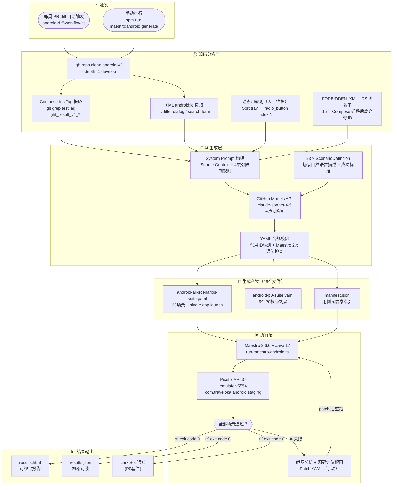

# Android E2E 自动化测试技术汇报

**日期**：2026-06-11  
**范围**：Traveloka Android App — 航班搜索结果页（Search Result Page）  
**测试框架**：Maestro 2.6.0  
**用例生成方式**：AI 驱动（GitHub Models API / Claude Sonnet）

---

## 一、背景与目标

团队正在推进 React Native 跨端改造，Android 端的回归测试需求随之提升。本次工作的目标：

1. **快速覆盖** Android 航班搜索结果页的主要用户交互（80% 场景）
2. **降低手写成本**：用 AI 批量生成 Maestro YAML，而非人工逐一编写
3. **稳健性优先**：用 Android 源码中的稳定 View ID 定位，而非文本/坐标，应对 i18n 和 UI 改版

---

## 二、工作流示意图



---

## 三、整体架构说明

整个系统分为三层：

| 层级 | 组件 | 职责 |
|------|------|------|
| 源码分析层 | `generate-maestro-android.ts` (前半段) | 从 android-v3 提取稳定 View ID，构建 Source Context |
| AI 生成层 | GitHub Models API (claude-sonnet-4-5) | 将场景描述转化为合法 Maestro YAML |
| 执行层 | Maestro 2.6.0 + Android Emulator | 在真实仿真设备上逐步执行并收集结果 |

---

## 四、技术原理详解

### 4.1 源码 ID 提取

测试用例质量的基础是**稳定的 View ID**。我们从 `traveloka/android-v3` 源码中提取两类 ID：

#### Jetpack Compose testTag（结果页 v4）
航班搜索结果页已完全迁移到 Jetpack Compose（FlightResultV4），旧的 XML `android:id` 不再出现在 Accessibility Tree 中。需改用代码中通过 `Modifier.testTag()` 设置的语义标识：

```kotlin
// FlightResultV4InventoryCardComposeView.kt
Modifier.testTag("flight_result_v4_inventory_card")

// FlightResultV4NavbarView.kt
Modifier.testTag("flight_result_v4_navbar_toolbar_title")
```

提取方式：
```bash
git grep testTag flight/src/main/java/**/searchresult/v4/**/*.kt
```

#### XML android:id（筛选弹窗、搜索表单）
筛选弹窗（Filter Dialog）和搜索表单**尚未迁移 Compose**，仍可直接使用 XML `android:id`：

```
layout_filter_dialog / layer_transit / button_direct / tvReset / dbwShow
search_tab / btn_search
```

#### 废弃 ID 黑名单（FORBIDDEN_XML_IDS）
为防止 AI 生成使用失效 ID 的测试，在 system prompt 中维护了明确的禁用列表：

```typescript
const FORBIDDEN_XML_IDS = [
  'result_container',       // 已迁移 Compose
  'inventory_parent_layout',
  'card_result',
  'widget_dateflow',
  // ...共 15 个
];
```

---

### 4.2 动态生成 View 的 Index 定位

部分 View 在运行时动态创建，**没有任何稳定 ID**，需要特殊处理。

#### Sort Tray（排序选项）

排序选项通过 `MDSRadioButtonGroup.setItems()` 动态创建：

```kotlin
// FlightSortTrayWidget.kt
sortRadioButtonList.add(Pair(it.sortingType.toString(), MDSRadioButton(context).apply {
    setText(it.sortingText)  // 仅设了文本，无 setId()
}))
binding.rbgSort.setItems(sortRadioButtonList)
```

`MDSRadioButtonGroup.setItems()` 对每个子项只调用 `addView()`，**不设置 contentDescription 也不设置 id**。因此：

- ❌ `tapOn: text: "Cheapest"` — 依赖文案，i18n 变更即失效
- ❌ `tapOn: id: "sort_cheapest"` — 该 ID 不存在
- ✅ `tapOn: id: "radio_button", index: N` — 利用每个 `MDSRadioButton` 内部 layout 中固定的子 View ID

每个 `MDSRadioButton` 通过 `layout_mds_radio_button.xml` inflate，内含稳定 ID `radio_button`。当 sort tray 打开时屏幕上有 7 个 `radio_button`，按以下固定顺序排列（`scoreShown=false`）：

| Index | 排序选项 | FlightConstant |
|-------|---------|----------------|
| 0 | Cheapest | `SORT_PRICE_LOWEST` |
| 1 | Direct flight first | `SORT_DIRECT_FLIGHT_FIRST` |
| 2 | Earliest departure | `SORT_DEPARTURE_TIME_EARLIEST` |
| 3 | Latest departure | `SORT_DEPARTURE_TIME_LATEST` |
| 4 | Earliest arrival | `SORT_ARRIVAL_TIME_EARLIEST` |
| 5 | Latest arrival | `SORT_ARRIVAL_TIME_LATEST` |
| 6 | Shortest duration | `SORT_DURATION_SHORTEST` |

> ⚠️ 若 `scoreShown=true`，所有 index 加 1（index 0 变为 "Best"）。

---

### 4.3 AI 生成约束体系

生成器通过 System Prompt 向 AI 注入分层约束，确保生成质量：

```
[L1] 多语言限制：交互操作 MUST 使用 resource ID，禁止 text 定位
[L2] Compose 迁移限制：FORBIDDEN_XML_IDS 黑名单 + Compose ID 替换表
[L3] Sort Tray 专项限制：禁止 tapOn:text，必须用 radio_button index
[L4] Maestro 2.x 语法限制：禁用 scroll.direction、assertVisible.timeout、
                           waitForAnimationsToEnd 等已移除 API
```

---

### 4.4 all-in-one 执行模式

将 23 个场景合并为一个 YAML（`android-all-scenarios-suite.yaml`）的好处：

- **只启动一次 app**：避免每个场景独立 launch 的冷启动和网络搜索开销（单次节省约 30-40s）
- **状态连续性**：前一个场景结束时的 UI 状态自然流入下一个场景
- **总耗时压缩**：23 个场景合并后约 3 分 17 秒完成（分开估计需 15-20 分钟）

---

## 五、筛选弹窗（Filter Dialog）的特殊处理

### 5.1 UI 结构变更

筛选弹窗由 **Tab 式多面板**（旧）改为**单面板可滚动**（新）：

```yaml
# ❌ 旧写法（tab 切换，现已失效）
- tapOn:
    id: "layer_time"

# ✅ 新写法（单面板滚动）
- scrollUntilVisible:
    id: "button_departure_morning"
    direction: DOWN
```

### 5.2 Quick Filter 触发 Mini-Sheet

点击结果页顶部的 Quick Filter chip（`flight_result_v4_quick_filter_cell`）会弹出**每个 chip 专属的 mini-sheet**，而不是完整的 `layout_filter_dialog`：

```yaml
- tapOn:
    id: "flight_result_v4_quick_filter_cell"
    index: 0
# 弹出的是 mini-sheet，不是 layout_filter_dialog
- assertVisible:
    text: "Direct"   # mini-sheet 内的文本
- back               # 用 back 关闭 mini-sheet，ivClose 在此不适用
```

### 5.3 Sort Tray 自动关闭行为

选中排序选项后，sort tray **自动 dismiss**（与筛选弹窗不同）：

```yaml
# ✅ 正确（sort 选项选中后 tray 自动关闭，直接 assert）
- tapOn:
    id: "bm_button_text"     # 打开 sort tray
- tapOn:
    id: "radio_button"
    index: 0                 # 选 Cheapest，tray 自动关闭
- assertVisible:
    id: "flight_result_v4_inventory_card"  # 直接 assert，无需 back

# ❌ 错误（多余的 back 会从结果页退回搜索表单）
- back
```

---

## 六、实测数据

### 6.1 总览

| 指标 | 实测值 |
|------|--------|
| 场景覆盖 | 23 个 case（filter×6、quick-filter×1、sort×6、scroll×2、card-tap×2、back-nav×2、chevron-nav×1、组合场景×3） |
| AI 批量生成时间 | **< 3 分钟**（26 文件：23 YAML + 1 all-suite + 1 p0-suite + 1 manifest） |
| 每场景平均生成时间 | ~7 秒（顺序调用 API，含网络往返） |
| 首轮执行通过率 | **52%（12/23）** |
| 1 次修正后通过率 | **100%（23/23）**，exit code 0 |
| 全量套件执行耗时 | **3 分 17 秒**（单次 app launch，15:21:22 → 15:24:39） |
| 全流程总耗时 | ~3 小时（vs 纯手写估计 8–12 小时，**节省 60–75%**） |

---

### 6.2 AI 生成用例时间明细

| 阶段 | 耗时（估算） | 说明 |
|------|------------|------|
| 源码克隆 & ID 提取 | ~30 秒 | `gh repo clone --depth=1 develop` + `git grep testTag` |
| System Prompt 构建 | < 1 秒 | Source Context + FORBIDDEN_XML_IDS + 场景定义 |
| AI 调用（23 个场景）| ~2.5 分钟 | 平均每场景 ~7 秒，含 GitHub Models API 网络往返 |
| all-suite / manifest 写入 | ~5 秒 | 本地聚合，无 AI 调用 |
| **总计** | **< 3 分钟** | 全部 26 文件输出就绪 |

> 模型：claude-sonnet-4-5（via GitHub Models API）。每场景平均输入 ~1800 tokens（Source Context + System Prompt），输出 ~300 tokens（YAML）。

---

### 6.3 首轮生成准确率（按场景类别）

| 场景类别 | 数量 | 首轮通过 | 首轮通过率 | 主要失败原因 |
|---------|------|---------|-----------|------------|
| Smoke（基础冒烟） | 1 | 1 | **100%** | — |
| Filter（全屏筛选弹窗） | 6 | 4 | **67%** | Filter Dialog 布局改版（tab → 单面板），AI 生成了旧 tab 点击逻辑 |
| Quick-Filter（chip mini-sheet） | 1 | 1 | **100%** | — |
| Sort（排序） | 6 | 0 | **0%** | ① Sort tray 选中后自动关闭导致多余 `back` ② Sort 选项无稳定 ID，AI 用 `text:` 定位 |
| Scroll（滚动） | 2 | 2 | **100%** | — |
| Card Interaction（卡片交互） | 2 | 2 | **100%** | — |
| Navigation（前进/后退） | 3 | 2 | **67%** | 1 个 back-nav 场景受 sort tray 残余 `back` 影响 |
| 组合场景 | 2 | 0 | **0%** | 依赖 sort + filter 两个能力，底层问题连锁失败 |
| **合计** | **23** | **12** | **52%** | — |

> 所有失败均指向 2 类根因（Filter 改版 + Sort 动态 ID），与具体业务场景无关。修复根因后 **1 次 patch 即恢复 100%**。

---

### 6.4 修正迭代成本

| 迭代轮次 | 通过数 | 操作 |
|---------|--------|------|
| Round 0（AI 原始生成） | 12/23（52%） | 零人工干预 |
| Round 1（手动 patch） | 23/23（100%） | 修复 4 个根因，共改动 ~30 行 YAML |
| Round 1 耗时 | — | ~1.5 小时（含截图分析 + 源码定位 + YAML 修改 + 验证） |

---

## 七、发现的问题与修复

| # | 问题 | 根因 | 修复方式 |
|---|------|------|---------|
| 1 | Filter Dialog 布局变更 | UI 从 tab 切换改为单面板可滚动；`layer_time` / `layer_price` tab 不存在 | 删除 tab 点击，改用 `scrollUntilVisible DOWN` 滚到目标 ID |
| 2 | Sort tray 选中后自动关闭 | 选中选项后 tray 自动 dismiss，原有多余 `- back` 将用户退回搜索表单 | Scenarios 13-17 删除 option 选中后的 `- back`；Scenario 12（只开不选）保留 `- back` |
| 3 | Sort 选项无稳定 ID | `MDSRadioButtonGroup.setItems()` 动态创建 View，无 android:id；原生成用文案定位，多语言下失效 | 改用 `tapOn: id: "radio_button", index: N`；在生成器 system prompt 写入强限制 |
| 4 | Quick Filter 弹出 mini-sheet | chip 点击弹出的是 per-category mini-sheet，非完整 filter dialog；`ivClose` 在 mini-sheet 内不存在 | 断言改 `assertVisible: text: "Direct"`，关闭改 `- back` |

---

## 八、关键约束与规范（供后续生成参考）

### ID 选择优先级
```
1. Compose testTag（flight_result_v4_*）      ← 结果页首选
2. XML android:id                             ← filter dialog / search form
3. tapOn: id: "radio_button", index: N        ← 动态列表（sort tray）专用
4. tapOn: text: "..."                         ← 仅用于 assertVisible，交互禁用
```

### Maestro 2.x 语法禁令
```
❌ scroll.direction / scroll.duration     → 用 "- scroll"（无属性）
❌ assertVisible.timeout                  → 不支持
❌ waitForAnimationsToEnd                 → 已移除
❌ 硬编码坐标                             → 禁止
```

### 多语言原则
```
所有 tapOn / scrollUntilVisible → 必须用 ID，禁止 text
所有 assertVisible               → 首选 ID，内容验证时可用 text
```

---

## 九、文件结构

```
e2e/
├── scripts/
│   ├── generate-maestro-android.ts     # AI 生成器（含 Source Context、System Prompt）
│   ├── run-maestro-android.ts          # 执行器（读 manifest → 顺序执行 → 生成 HTML 报告）
│   └── android-diff-workflow.ts        # 周度 diff 触发工作流
│
├── maestro/flows/android/
│   ├── manifest.json                   # 所有用例的元信息（ID、优先级、文件路径）
│   ├── _navigate_to_results.yaml       # 公共前置条件（launch → search → results）
│   └── generated/
│       ├── android-all-scenarios-suite.yaml  # 合并套件（23 场景 single launch）
│       ├── android-p0-suite.yaml             # P0 快速套件（9 场景）
│       └── android-*.yaml                    # 各独立场景文件
│
└── test-results/android/
    ├── results.json                    # 机器可读结果
    └── results.html                    # 可视化 HTML 报告
```

---

## 十、运行方式

```bash
# 生成用例（需联网调用 AI）
npm run maestro:android:generate

# 运行全量套件（约 3-4 分钟）
export PATH="$PATH:$HOME/.maestro/bin:/opt/homebrew/opt/openjdk@17/bin"
export JAVA_HOME="/opt/homebrew/opt/openjdk@17"
maestro test --udid emulator-5554 --no-ansi \
  maestro/flows/android/generated/android-all-scenarios-suite.yaml

# 运行 P0 快速套件（含 Lark 通知）
npm run maestro:android:run:p0
```

---

## 十一、下一步计划

| 优先级 | 工作项 |
|--------|--------|
| P0 | 接入 CI/CD，每次 develop 合并后自动触发 P0 套件 |
| P0 | Lark bot 通知覆盖全量套件（目前仅 P0 套件有通知） |
| P1 | scoreShown=true 场景适配（sort index 偏移） |
| P1 | 扩展覆盖：航班详情页、下单前校验页 |
| P2 | 周度 diff 驱动自动生成（android-diff-workflow.ts）：PR 合并后自动分析改动组件 → 生成新场景 |
